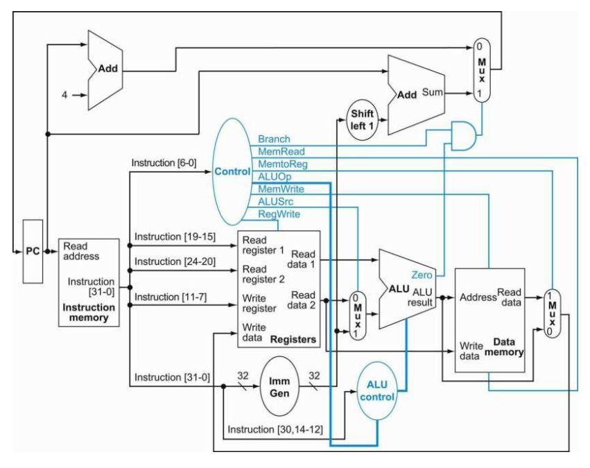

## 32-bit CPU Verilog Implementation

This project is a single cycle RISC-V processor (32-bit) implementation in (System)Verilog solely for educational purposes. Only 11 instructions were implemented (see RV32I), making it a good reference for those looking for a simple CPU implementation.

It served as an exercise to learn more about how digital circuits (at RTL level) are designed and it was an attempts to familiarize myself with the lower levels of computer science.

## Development Environment 

The development of this project was done on a MacBook (arm) using the following tools.

1. Install [Icarus Verilog](https://github.com/steveicarus/iverilog) from source
2. Install [GTKWave](https://github.com/gtkwave/gtkwave) from source
3. Test your setup using the [Icarus Verilog examples](https://steveicarus.github.io/iverilog/usage/gtkwave.html)

## Architecture Diagram

<p align="center">

</p>

NYCU's [Computer Organization course's](https://people.cs.nycu.edu.tw/~ttyeh/course/2024_Spring/CS10014/outline.html) slides and code templates were used as a reference during the implementation.

## Roadmap

### Assembler - [[code](./src/assembler/)] . [[docs](./docs/assembler.md)]

1. [x] Write an assembler in any programming language (e.g. Python) that reads assembly instructions from a text file and turns them into machine code (a .mem file) 
2. [x] Write unit tests for the assembler checking the machine code
3. [x] Use `$readmemb` to read the .mem file in your Verilog testbench and store the instructions in [program memory](./src/core/program_memory.sv)

The example assembly file contains the following code, which should result in *alu_mux_out_wire* holding the value 6 after 50 time units.

```sh
lw r1, 1
addi r2, r1, 2 
sw r2, 1
lw r3, 1
addi r4, r3, 3
```

### CPU Core - [[code](./src/core/)]

The CPU core implementation in Verilog.

| File  | Description | 
| ------------- | --------------| 
|    [[program_memory.sv](./src/core/program_memory.sv)]       |  Stores the instructions (in machine code)loaded from the memory file. | 
|    [[program_counter.sv](./src/core/program_counter.sv)]     |  Forwards the next instruction address to program memory on the positive edge of clock. | 
|    [[register_file.sv](./src/core/register_file.sv)]     | A 32x32 CPU register file, also read [RISC-V ISA Specification](https://riscv.org/technical/specifications/) for more details.  | 
|    [[control.sv](./src/core/control.sv)]     | Takes care of the selects and enables of other modules in the circuit based on the instruction's opcode. Use the [RISC-V ISA Specification](https://riscv.org/technical/specifications/) as a reference, especially the *RV32/64G Instruction Set Listings*. | 
|     [[alu_control.sv](./src/core/alu_control.sv)]  | Tells ALU which operation to perform | 
|      [[alu.sv](./src/core/alu.sv)]   |  Contains the actual circuitry to do the operations. | 
|       [[imm_generator.sv](./src/core/imm_generator.sv)]  | Handles the immediates based (incl. sign extension) on the opcode. Use the *Immediate Encoding Variants* section in the spec as a reference. | 
|    [[data_memory.sv](./src/core/data_memory.sv)]     |  Stores data (not the instructions) and can be used with the lw and sw, i.e. load and store, instructions. | 
|     [[core.sv](./src/core/core.sv)]    |  Connects all other modules together and allows you to configure what you want to output to GTKWave. | 

### Verification & Testing - [[code](./src/verifcation/)]

Run the  [`compile.sh`](./src/verifcation/compile.sh) script to use the assembler, compile your Verilog implementation, and run GTKWave to see the results of your testbench.

```sh
# from verification dir
./compile.sh
```

## Implemented Instructions

| Mnemonic      | Type          | Example .asm   |
| ------------- | --------------|----------------|
|    add        |  R-type       | `add r3, r2, r1` |
|    sub        |  R-type       | `sub r3, r2, r1` |
|    and        |  R-type       | `and r3, r2, r1` |
|    or         |  R-type       | `or r3, r2, r1`  |
|    slt        |  R-type       | `slt r3, r2, r1` |
|    addi       |  I-type       | `addi r3, r2, 5` |
|    andi       |  I-type       | `andi r3, r2, 5` |
|    ori        |  I-type       | `ori r3, r2, 5`  |
|    slti       |  I-type       | `slti r3, r2, 5` |
|    lw         |  I-type       | `lw r1, 1`       |
|    sw         |  S-type       | `sw r1, 1`       |

## References

- [nycu-caslab/CO2024_source repository](https://github.com/nycu-caslab/CO2024_source/tree/main)
- [nycu-caslab.github.io](https://nycu-caslab.github.io/CO2024/index.html)
